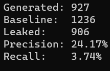
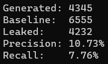
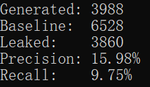
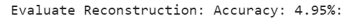
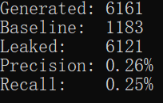
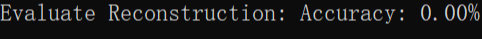

# pii_results
This repository is used for storing models and results from the [CSIRO summer internship project](https://github.com/HurricaHjz/analysing_pii_leakage)

# ECHR Models:
All the models here are fine-tuned using the  [ECHR](https://huggingface.co/datasets/ecthr_cases) dataset
## GPT2:
Fine-tuned the pretrained [GPT2](https://huggingface.co/gpt2) model
### MG01: 
[Configuration](./MG01/MG01_config.yml): undefended model trained on 30% of the original dataset 

[Performances](./results/MG01)：
  extraction  2500:  

  extraction 15000:  

  inference:  

### MG02: 
[Configuration](./MG02/MG02_config.yml): undefended model trained on 100% of the original dataset 

[Performances](./results/MG02)：
  extraction  2500:  

  extraction 15000:  

  inference:  

### MG03: 
[Configuration](./MG03/MG03_config.yml): dp-8 model trained on 100% of the original dataset 

[Performances](./results/MG03)：
  extraction  2500:  

  extraction 15000:  

  inference:  

## BERT:
Fine-tuned the pretrained Bert model